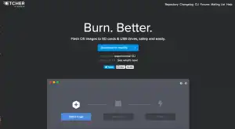
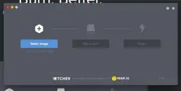
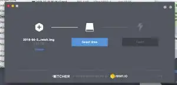
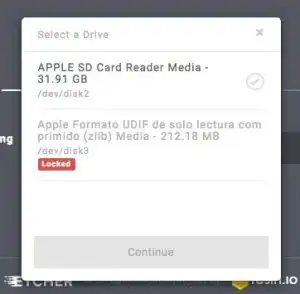
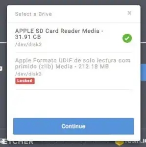
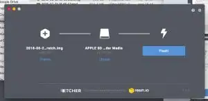
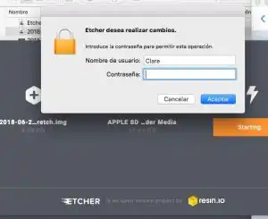
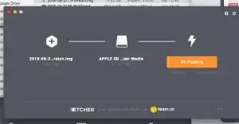
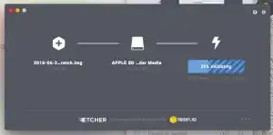
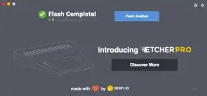

He intentado cambiar de S.O. mi raspberry pi y me he encontrado con que mi tarjeta SD estaba ya particionada, así que aquí os explico cómo solucionarlo con Etcher.io.

## Etcher.io.

Mi tarjeta SD estaba particionada, y tuvimos que arreglarlo.

Primero intentamos hacerlo con la Utilidad de Discos de Mac, probando a borrar las particiones. También tratamos de cambiarles el formato, y montarlas y desmontarlas. Pero nada dio resultado.

Como la Utilidad de Discos de mi MacBook se nos quedaba pequeña para lo que queríamos hacer, instalé Etcher.io. 

Etcher.io es una aplicación que te permite particionar e instalar un nuevo Sistema Operativo desde una imagen y desde distintas unidades. En las siguientes fotos voy a enseñaros cómo usar la aplicación fácilmente. 

En este paso tenéis que seleccionar la imagen. Para eso, seleccionad la .img que os aparezca. 

Una vez que habéis seleccionado la imagen, pasáis a seleccionar el disco.  

En mi caso, seleccioné ese, porque es el que quería unificar: la tarjeta SD. No va a poner el nombre que le hayáis dado a la tarjeta, si no la ranura del ordenador en la que esté introducida, como podéis ver en las fotos.

Y, a continuación, clicáis en FLASH! para que comience la operación.

Os pedirá la contraseña del usuario para permitir la operación. La introducís, y la operación comenzará.

 

Como veis, la barra se va llenando lentamente y cambiando de color según la tarea que esté llevando a cabo. 

Y, por último, habréis terminado.

## Más entradas sobre Raspberry Pi.

Este artículo es sencillo porque es un añadido a la serie de entradas sobre la Raspberry Pi que estoy haciendo. Quería explicar en detalle cómo solucionar este problema por si a alguno de vosotros os ha ocurrido como a mí sin abusar del post principal, que está enlazado arriba. Si queréis saber más sobre mi proceso de introducción en este mundillo, buscad el resto de entradas para haceros una idea. ¡Nos vemos!
