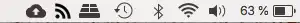
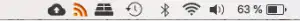

¿Cómo os apañáis vosotros para estar al tanto de nuevos artículos de vuestros blogs favoritos? Sé que mucha gente utiliza las redes sociales, como Twitter o Facebook. De esta forma, si el escritor anuncia un nuevo artículo con un Tweet, están enterados. Sin embargo, a mí no me gusta estar pendiente de las redes sociales para esto. Así que he decidido dar lo que muchos considerarían un paso atrás a nivel tecnológico. Voy a volver a usar los famosos feed RSS. Y la verdad es que, a día de hoy, me siguen pareciendo la mejor opción para estar al tanto.

## ¿Qué es un feed RSS?

Los feed RSS son archivos que mandan algunas webs. Estos archivos contienen ítems, que a su vez suelen contener el título, IRL y alguna información más de las entradas del blog. También pueden ser noticias de un portal de noticias, artículos de revistas, etc.

## ¿Para qué se utilizan estos feed RSS?

Con ellos podemos utilizar aplicaciones o webs, que comprueban su hay artículos nuevos en las webs que tengan activo el servicio de RSS.

En mi caso, por ejemplo, he decidido empezar a utilizar [RSS Bot para Mac](https://itunes.apple.com/es/app/rss-bot-news-notifier/id605732865?mt=12).

Esta app coloca un icono en la barra de herramientas de nuestro Mac, que cambiará de color cuando haya nuevos artículos para leer de los blogs que sigas.

-  Así es como se ve cuando no hay artículos nuevos para leer.
-  Y así es como se ve cuando sí hay notificaciones nuevas sobre artículos por leer.

A mí me está funcionando muy bien, así que si alguien se anima a utilizar RSS os la recomiendo.

Una vez instalada la app, deberemos empezar a añadir los RSS de las páginas que queremos seguir.

Hoy en día, esto se ha complicado bastante. Hace un tiempo, era muy popular añadir un icono de RSS en las páginas, así que era muy fácil encontrarlos, sin embargo, en la actualidad tendremos que buscarnos la vida para encontrarlos.

La mayoría de los blogs usan WordPress, así que si es el caso podrás probar a introducir la URL de la página y añadir /feed al final.

Por ejemplo:

- [acabadoene.es/feed](http://acabadoene.es/feed)
- [minimalismo.com/feed](https://minimalismo.com/feed)

Otros blogs son más complicados de conseguir. De los que yo sigo, por ejemplo, el de Microsoft Azure. Tuve que indagar bastante por la web, pero aquí lo tenéis: [azurecomcdn.azureedge.net/es-es/blog/feed/](https://azurecomcdn.azureedge.net/es-es/blog/feed/)

Es por esto que, si quieres seguir muchas webs, al principio vas a tener que investigar bastante. Pero creo que en poco tiempo compensa el esfuerzo inicial con creces, por lo que te animo a hacerlo.

Y por último, como un añadido, os dejo la RSS del blog que tienen montado los de Tuenti: [tuenti.socialmood.com/feed](http://tuenti.socialmood.com/feed)
