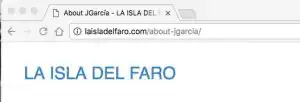
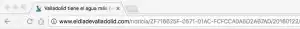

Hoy en día todo el mundo habla de posicionarse en Google. Hay un montón de estudios de buena praxis, e incluso Google tiene su propia [guía para principiantes de Google](https://static.googleusercontent.com/media/www.google.es/es/es/webmasters/docs/guia_optimizacion_motores_busqueda.pdf), que te inicia en el SEO. Te recomiendo que le eches un ojo, porque quién va a explicarte mejor qué debes hacer para indexarte en Google que ellos mismos. Las URL, aunque parezca mentira, también juegan un factor importantisimo a la hora de indexarte en Google. Por ello, mi recomendación personal es que programéis vuestra web con URL amigables o \'_pretty URL_\'.

## URL amigables para el SEO.

 Ejemplo de URL amigable: [laisladelfaro.com/about-jgarcia/](http://laisladelfaro.com/about-jgarcia/)

Las URL amigables, a diferencia de las convencionales, son URL que son perfectamente entendibles por un usuario de la página. Es decir, este sabe lo que está pasando al entrar en esa dirección. Por ejemplo, una URL amigable puede ser medida.com/volumen/metro-cubico. Esta URL, que me acabo de inventar sobre la marcha para medida.com, ayudará al usuario a identificar que dentro de medida se encuentra en el apartado de medidas de volumen, dando a intuir que puede haber otros apartados como el apartado distancia, y a su vez está informándose sobre metro cúbico.

Como podrás ver he puesto metro-cubico sin acentos y con un guion en medio separando las palabras. Esto es así porque con un - en medio en la mayoría de casos en informática y en concreto en Google se identifica que son dos palabras distintas. En cambio, si pones guion bajo u otras alternativas que se te puedan ocurrir, le dificultarás el trabajo a Google.

Por otro lado, muchos ya sabréis también que las tildes no son muy amigas de la informática y que muchas veces no se interpretan como deben. Por esto, es importante evitarlas.

Como verás, esa URL se interpreta mucho mejor que una URL convencional (como podría ser medida.com?p=12), donde no sabríamos que está pasando.

 Ejemplo de URL no amigable.

## Agrupaciones.

Gracias a las agrupaciones, como en el caso de la pretty URL con /volumen/, Google va entender que eso puede ser una categoría. Esto hará que, posiblemente, al cabo del tiempo tu página se muestre en Google con enlaces a las categorías. Esto hará que tu página ocupe más en los resultados de Google y, por lo tanto, llame más la atención.

Por si tienes dudas a la hora de planificar tus URL, Google da más importancia a lo que aparece más a la izquierda. Así, por ejemplo, en medida.com daría más importancia a medida.com. Luego, con algo menos de importancia, estaría volumen y, por último, metro-cubico.

Por lo tanto, en un principio será más fácil que nos encuentren si buscan medida o buscan volumen que si buscan metro-cubico.
