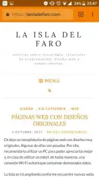
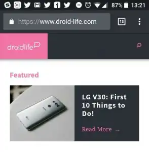
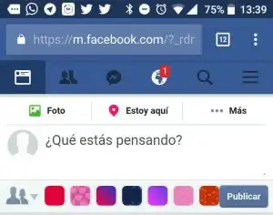

Desde hace ya un tiempo, navegadores como Chrome (creo que solo en su versión Android), Vivaldi y otros adaptan el color del navegador (theme-color) según la página a la que entres. Así, por ejemplo, Facebook pasa a ser azul, y laisladelfaro.com se ve así: 

La zona de la barra de búsquedas es de un color naranja, semejante al theme-color (color clave) del esquema de la página. Esto es algo que, en mi opinión, armoniza el aspecto de la página en el buscador, y me sorprende que la mayoría de las páginas web hayan mantenido el theme-color que viene por defecto. Sobre todo si este color no encaja con su diseño.

Me sorprende, no solo porque da un aspecto visual diferente y llamativo, sino porque Google premia este elemento mejorando el valor de la web en el posicionamiento.

## **Cómo se hace:**

Realmente es muy sencillo. Para que nuestra página web cuente con ello basta con añadir lo siguiente al `<head></head>` del código: `<meta name=theme-color content=#ColorQueDesees>`

## **En cuanto al theme-color.**

Cada página debería tener un esquema de colores principal, que contenga dos colores base y al menos un color de contraste. Por ejemplo, los colores base de laisladelfaro.com son el blanco y el naranja, y el color contraste es el rojo.

Así, podéis escoger entre uno de vuestros colores complementarios o de contraste para la barra de menú. Depende de la claridad de vuestros colores complementarios, a lo mejor contrastar puede darle un toque divertido, y viceversa.

Por ejemplo. Si la paleta de colores de vuestra web es neutra (basada en blancos, cremas y beiges), tenéis dos opciones:

- Darle un toque tranquilo, con una barra de menú en color crema.
- Darle un toque divertido, con una barra llamativa, en vuestro color de contraste.

Si vuestra paleta es pastel, podéis hacer la barra en un color más oscuro dentro de la misma gama, como por ejemplo azul eléctrico en una página azul pastel, etc.

Y, en cambio, si tenéis una paleta de colores agresiva, con colores azules oscuros, como Facebook, yo os recomendaría utilizar un color que ya hayáis empleado en el fondo, en el logo, o el otro lugar.

A continuación os dejo un enlace donde explican los diferentes colores de contraste y complementariedad para el diseño:
[Rueda cromática](https://color.adobe.com/es/)

Así que si tienes una página web y te parece un tema interesante, prueba a añadir la etiqueta. O, si conoces a alguien que tiene una, comparte este artículo con ellos para que lo hagan.Si necesitáis ayuda podéis contactar conmigo, porque creo que es un elemento que merece la pena tener.
