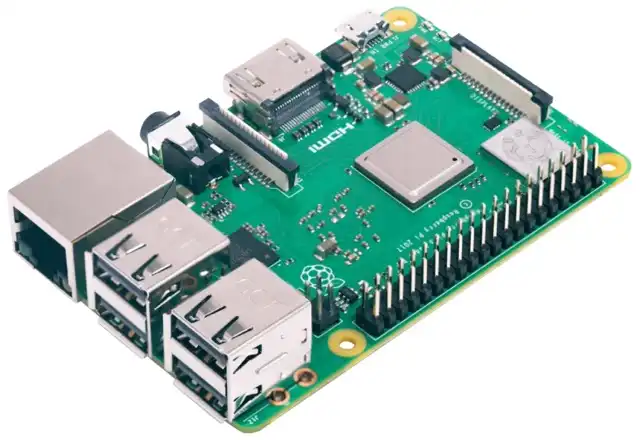
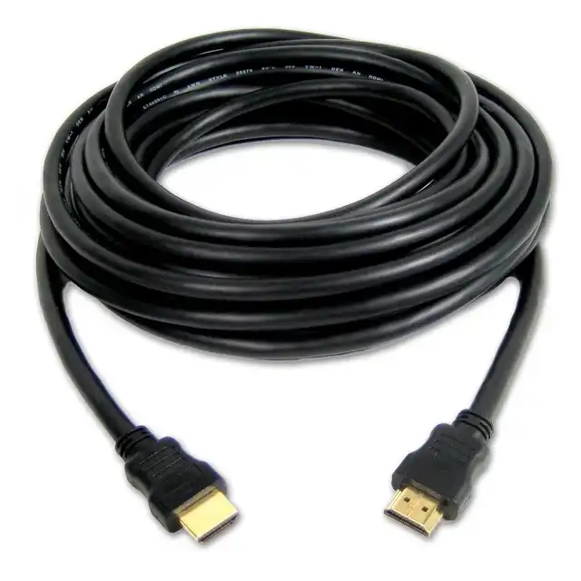
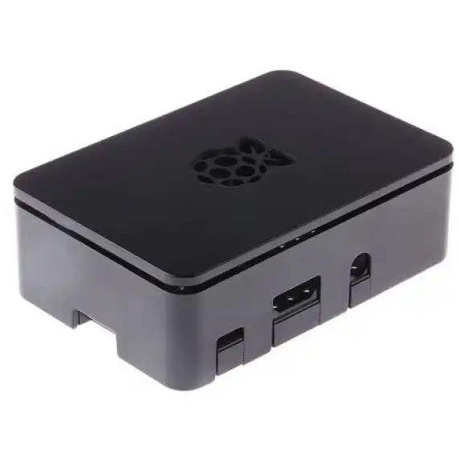
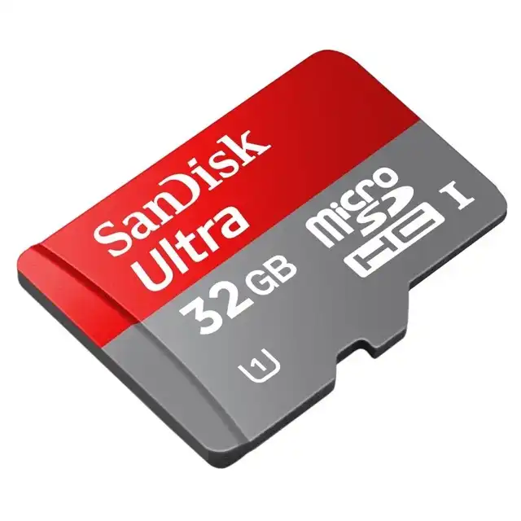
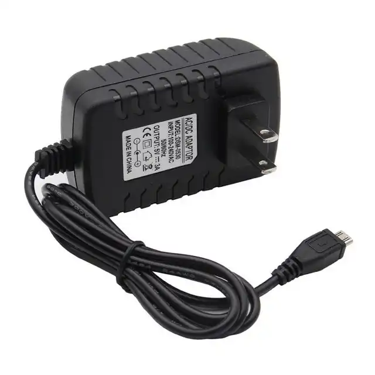

Hace unos meses, decidí comprarme una Raspberry Pi y empezar a aprender cómo funciona y todas las cosas que se pueden hacer con ella. He decidido hacer unos cuantos posts en los que iré explicando todo lo que he aprendido sobre ella con JotaGarciaz, que ya tenía una.

Este será el primero, y en él hablaré de todo lo que tengo nuevo.

## ¿Qué necesitas?

Lo primero: una **Raspberry**. La mía es la Raspberry Pi 3B+. Sin embargo, si tenéis una anterior también vale.

Un cable **HDMI** para poder conectar la Raspberry a cualquier pantalla. En concreto, yo la conecto a la televisión, pero cualquier pantalla, como la de un ordenador de sobremesa, valdría.

Una **carcasa** para la Raspberry. Esto es opcional, aunque a mí me ha parecido muy útil a la hora de conservar mejor todas las conexiones que tiene la RPi al aire. Cualquier carcasa vale, mientras esté pensada para tu modelo de Raspberry en específico, e incluso a veces puedes comprar la RPi ya con una carcasa.

Una **tarjeta SD**. Esta tarjeta, que yo tengo de SanDisk de 32GB, y como mínimo debería ser de 16GB (más de 8), sirve como la memoria de la RPi. Así que es muy importante. Es también importante que sea de clase 10, para que sea rápida. Os dejo un enlace para nuestra tarjeta, porque realmente creo que es de las mejores. Perfecta para la Raspberry, desde luego. Podéis comprarla [aquí](https://www.amazon.es/Tarjeta-SanDisk-microSDHC-adaptador-velocidad/dp/B073JWXGNT).

Y, por último, un **cargador**. La Raspberry necesita estar conectada a la corriente para poder funcionar. Es por esto que necesitas un cable que se conecte a la corriente. El mío tiene un interruptor para apagar la Raspberry sin desconectarla de la corriente, pero no es necesario. De hecho, es mejor que no tenga el interruptor porque es un punto en el que falla. Además, otra cosa que es importante es que el cargador recomendado para la 3b es uno de 3a. Y también se puede decir que no es necesario el interruptor porque la Raspberry consume tan poco que, dado el uso que suele tener, está destinada a estar siempre encendida.

## Algunos consejos.

Tanto la pantalla, como un ratón y/o un teclado, son solamente necesarios al principio, cuando tienes que configurar la Raspberry por primera vez. El resto de veces que la utilices podrás hacerlo desde tu propio ordenador portátil, que es como yo lo hago, y como lo considero más cómodo. JotaGarciaz siempre dice que es opcional, pero si quieres usarla como un ordenador normal también puedes.

También puedes hacerlo sin ratón ni teclado, pero es algo más complicado. Seguro que JotaGarciaz puede ponerse a preparar un tutorial de cómo hacerlo para vosotros. Lo traeremos también. De hecho, si optáis por este método el HDMI sería opcional también.

## Siguientes posts sobre la Raspberry.

Dentro de poco iré haciendo más artículos en los que hable de todo lo que JotaGarciaz me ha enseñado sobre mi nueva RPi. Así que, si queréis aprender, estad atentos.

El siguiente post es [RPi: Sistemas Operativos](../raspberry-pi-configuracion-sin-perifericos).
